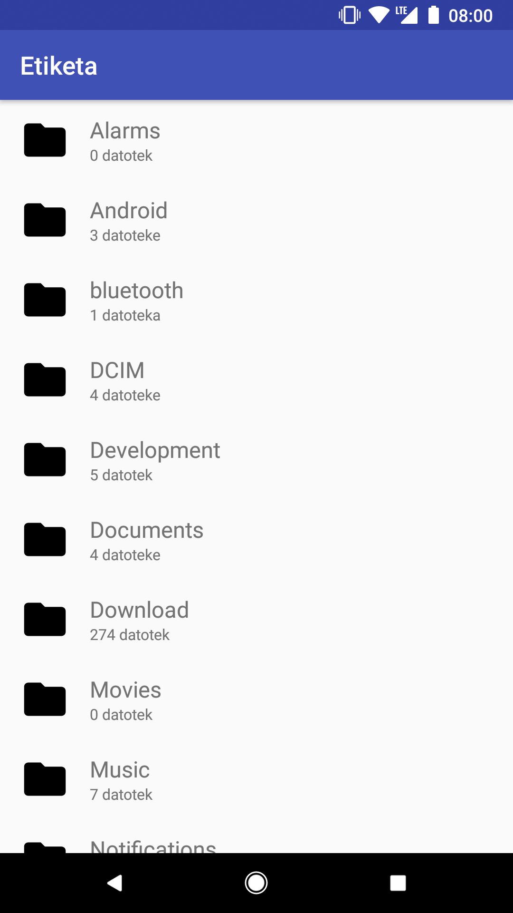

# etiketa

Ta projekt je rezultat projektne naloge pri informatiki na splošni maturi.
Naslov projektne naloge je "Uporaba JNI v razvoju Android aplikacije".

Prva javna izdaja je na voljo pod "1 release".

