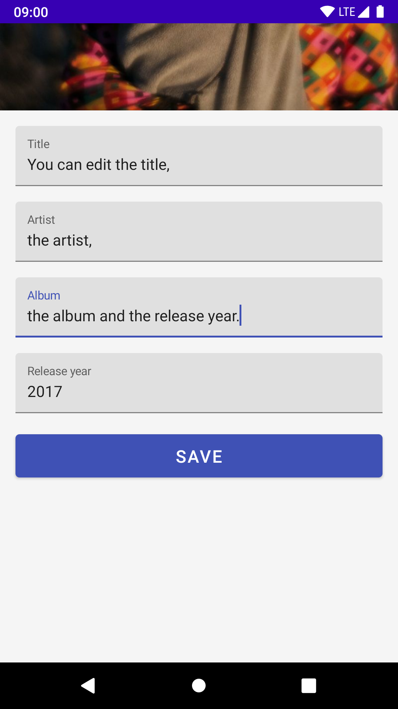

# etiketa

Etiketa je Android aplikacija, ki omogoča spreminjanje metapodatkov MP3 in FLAC glasbenih datotek. Dostop do metapodatkov poteka preko knjižnice TagLib.

## Načrtovane spremembe in izboljšave

* Uporaba storage access framework (uporaba File v prihodnje ne bo več možna)
* <strike>Dark Theme podpora</strike> <i>(Done)</i>
* Možnost spremembe slike (artwork)
* 'Single Activity' design
* Deljenje informacij preko ViewModel (npr. izbrana datoteka)

## Uporabniški vmesnik
<table><tr>
<td>  </td>
<td>  </td>
<td>  </td>
<td>  </td>
<td>  </td>
</tr></table>

## O projektu

Projekt je nastal v okviru projektne naloge pri informatiki na splošni maturi z naslovom "Uporaba JNI v razvoju Android aplikacije".